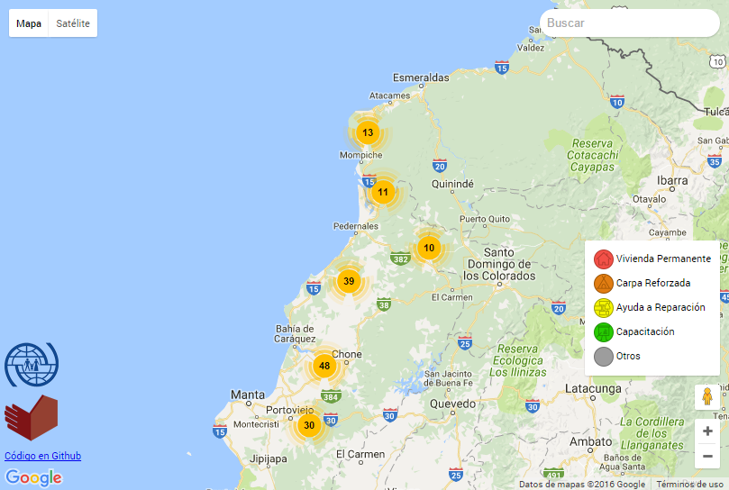

Activity Map
============

This project uses Google Maps and Google Spreadsheets to show activity on a map. It was initially
conceived to show humanitarian actions for the 2016 Ecuador earthquake, in relation to Shelter
activities, but it can be used for almost anything.

Each point on the map belongs to a different source (in the example below, a source means an
organization), and has a type that defines the icon shown.

Example
-------

Configuration
-------------

1. [Create an API Key](https://developers.google.com/maps/documentation/javascript/) for using
   Google Maps.
2. Create spreadsheets for each source. Take note of the Spreadsheet ID (you can copy this from the
   URL), and publish them by using the "Publish to the web" option in the "File" menu.
3. Put the code in a PHP-enabled web server.
4. Copy `config.sample.php` into `config.php`, and edit it accordingly.
5. Create the icons for the different types. Optionally, create alternative versions for the legend
   block.

Thanks
------

* [jQuery FriendlyId](https://github.com/formaweb/jquery.friendly_id)
* [Marker Clusterer](https://github.com/googlemaps/js-marker-clusterer)

_Development sponsored by [IOM](http://www.oim.org.ec)._
